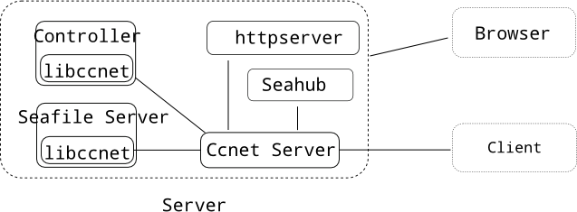
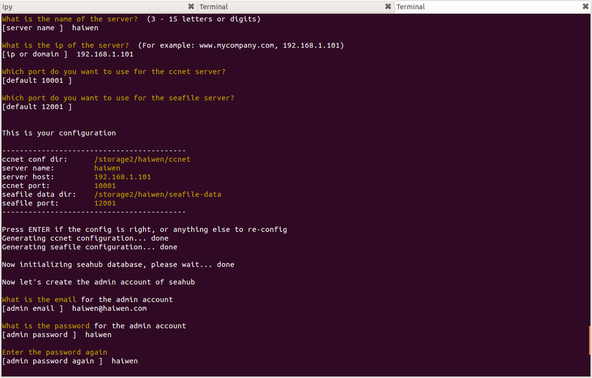

# Server

## Preparation

The following list is all the libraries you need to install on your machine. **You should install all of them before you build seafile**.

Package names are according to Ubuntu 12.04. For other Linux distros, please find their corresponding names yourself.

* libevent-dev  (2.0 or later )
* libcurl4-openssl-dev  (1.0.0 or later)
* libglib2.0-dev (2.28 or later)
* uuid-dev
* intltool (0.40 or later)
* libsqlite3-dev (3.7 or later)
* libmysqlclient-dev (5.5 or later)
* libarchive-dev
* libtool
* libjansson-dev
* valac
* libfuse-dev

Also, python 2.7 is required since seafile server 5.1.0.

The following libraries need to be compiled from source.

### libzdb

* Install `re2c` and `flex`
* Download [libzdb](http://www.tildeslash.com/libzdb/dist/libzdb-2.12.tar.gz)

#### libevhtp

* Download [libevhtp](https://github.com/ellzey/libevhtp/archive/1.1.6.tar.gz).
* Build libevhtp by:

```
cmake -DEVHTP_DISABLE_SSL=ON -DEVHTP_BUILD_SHARED=ON .
make
sudo make install

```

### Seahub dependencies

**Seahub** is the web front end of Seafile. It's written in the [django](http://djangoproject.com) framework. Seahub requires Python 2.6(or 2.7) installed on your server, and it needs the following python libraries:

- Django 1.8
- pytz
- django-statici18n
- djangorestframework
- django_compressor
- django-post_office
- [django-constance](https://github.com/haiwen/django-constance/) (install it by `pip install https://github.com/haiwen/django-constance/archive/bde7f7c.zip`)
- gunicorn
- flup
- chardet
- python-dateutil
- six
- openpyxl

Before continue, make sure you have all the above libraries available in your system.

### Prepare the directory layout

In the following sections, you'll be guided to build and setup the seafile server step by step. Seafile server is consisted of several components. In order for them to function correctly, you must:

* Follow our instructions step by step
* Make sure your directory layout is exactly the same with the guide in each step.

First create the top level directory. In the following sections, we'll use "/data/haiwen" as the top level directory.

```
mkdir /data/haiwen/
cd /data/haiwen/
mkdir seafile-server
cd seafile-server
```

The currently layout is:

```
haiwen/
└── seafile-server
```

### Get the source

First you should get the latest source of libsearpc/ccnet/seafile/seahub

Download the source tarball of the latest tag from

* https://github.com/haiwen/libsearpc/tags
* https://github.com/haiwen/ccnet/tags
* https://github.com/haiwen/seafile/tags
* https://github.com/haiwen/seahub/tags

For example, if the latest released seafile server is 4.4.7, then just use the **v4.4.7-server** tags of the projects (except for libsearpc, which uses the **v3.0-latest** tag). You should get four tarballs:

* libsearpc-3.0-latest.tar.gz
* ccnet-4.4.7-server.tar.gz
* seafile-4.4.7-server.tar.gz
* seahub-4.4.7-server.tar.gz

Create a folder `haiwen/src`, and uncompress libsearpc/ccnet/seafile source to it.

```
cd haiwen/seafile-server
mkdir src
cd src
tar xf /path/to/libsearpc-3.0-latest.tar.gz
tar xf /path/to/ccnet-4.4.7-server.tar.gz
tar xf /path/to/seafile-4.4.7-server.tar.gz
```

And uncompress seahub tarball to `haiwen/seafile-server`:

```
cd haiwen/seafile-server
tar xf /path/to/seahub-4.4.7-server.tar.gz
mv seahub-4.4.7-server seahub
```

So far, The current directory layout is:

```
haiwen/
└── seafile-server
    └── seahub
    └── src
        ├── libsearpc-4.4.7-server
        ├── ccnet-4.4.7-server
        ├── seafile-4.4.7-server
        ├── ... (other files)
```

### Building

To build seafile server, you need first build **libsearpc** and **ccnet**.

##### libsearpc

```
cd libsearpc-${version}
./autogen.sh
./configure
make
make install
```

##### ccnet

```
cd ccnet-${version}
./autogen.sh
./configure --disable-client --enable-server   # `export PKG_CONFIG_PATH=/usr/local/lib/pkgconfig` if libsearpc is not found
make
make install
```

##### seafile

```
cd seafile-${version}
./autogen.sh
./configure --disable-client --enable-server
make
make install
```


*Note*: You need to run `sudo ldconfig` to refresh the system libraries cache after you compiles all the components.

## Deploy Seafile Server

### Components of the Seafile Server

The seafile server consists of the following components:

<table>
  <tr>
    <th>Process Name</th><th>Functionality</th>
  </tr>
  <tr>
    <td>ccnet-server</td><td>underlying networking</td>
  </tr>
  <tr>
    <td>seaf-server</td><td>data management</td>
  </tr>
  <tr>
    <td>Seahub</td><td>website front-end of seafile server</td>
  </tr>
  <tr>
    <td>fileserver</td><td>handles raw file upload/download for Seahub</td>
  </tr>
</table>



* **ccnet** stores its configuration and metadata is a directory named `ccnet`.
* **seaf-server** store its configuration and data in a directory, normally named `seafile-data`.
* **seahub** is written in Django. If you have any experience with Django, you should know the `syncdb` command must be run to create all the database tables.
* An **admin account** has to be created, so that you, the admin, can login with this account to manage the server.

These are the essential steps to create the configuration:

* ensure seafile is already installed and all the python libraries seahub needs are installed.
* create the ccnet configuration with the **ccnet-init** program
* create the seafile configuration with **seaf-server-init** program
* run Django **syncdb** command for seahub
* create an admin account for the seafile server

To create the configurations, you can either:

* use the seafile-admin script(see below)
* [[create server configuration by hand]]


### Create Configurations with the seafile-admin script

`seafile-admin` should have been installed to system path after you have built and installed Seafile from source.
```
usage: seafile-admin [-h] {setup,start,stop,reset-admin} ...

optional arguments:
  -h, --help            show this help message and exit

subcommands:

  {setup,start,stop,reset-admin}
    setup               setup the seafile server
    start               start the seafile server
    stop                stop the seafile server
    reset-admin         reset seafile admin account
```

Go to the top level directory(in this guide it's **/data/haiwen/**), and run **seafile-admin setup** to create all the configuration:
```
cd /data/haiwen
export PYTHONPATH=/data/haiwen/seafile-server/seahub/thirdpart
seafile-admin setup
```

The script would ask you a series of questions, and create all the configuration for you.

<table>
  <tr>
    <th>Name</th><th>Usage</th><th>Default</th><th>Requirement</th>
  </tr>
  <tr>
    <td>server name</td>
    <td>The name of the server that would be shown on the client</td>
    <td></td>
    <td>3 ~ 15 letters or digits</td>
  </tr>
  <tr>
    <td>ip or domain</td>
    <td>The ip address or domain name of the server</td>
    <td></td>
    <td>Make sure to use the right ip or domain, or the client would have trouble connecting it</td>
  </tr>
  <tr>
  <td>ccnet port</td>
  <td>the tcp port used by ccnet</td>
  <td>10001</td>
  <td></td>
  </tr>
  <tr>
    <td>seafile port</td>
    <td>tcp port used by seafile</td>
    <td>12001</td>
    <td></td>
  </tr>
  <tr>
    <td>seafile fileserver port</td>
    <td>tcp port used by seafile fileserver</td>
    <td>8082</td>
    <td></td>
  </tr>
  <tr>
    <td>admin email</td>
    <td>Email address of the admin account</td>
    <td></td>
    <td></td>
  </tr>
  <tr>
    <td>admin password</td>
    <td>password of the admin account</td>
    <td></td>
    <td></td>
  </tr>
</table>

This is a screenshot of the **seafile-admin setup** command:


And a screenshot after setup is finished successfully:


At this time, the directory layout would be like this:
```
haiwen/
└── ccnet # ccnet config directory
    └── ccnet.conf # ccnet config file
└── seafile-data # seafile configuration and data
    └── seafile.conf # seafile config file
└── seahub-data/ # seahub data
└── seahub.db # seahub sqlite3 database
└── seahub_settings.py # custom settings for seahub
└── seafile-server
    └── seahub/
    └── seafile-{VERSION} # seafile source code
```

### Start the Seafile Server

After configuration successfully created, run **seafile-admin start** in the top directory to start the all components of Seafile. ( **You should always run the seafile-admin script in the top directory** ).

```
cd /data/haiwen # go to the top level directory
seafile-admin start
```

At this moment, all the components should be running and seahub can be visited at **http://yourserver-ip-or-domain:8000**

**Note** You may want to deploy seahub with nginx or apache. In this case, follow the instructions on Deploy Seafile Web With [Nginx](../deploy/deploy_with_nginx.md)/[Apache](../deploy/deploy_with_apache.md).

### Stop the Seafile Server

To stop seafile server, run **seafile-admin stop**.

```
cd /data/haiwen # go to the top level directory
seafile-admin stop
```

## Upgrade the Seafile Server

When you want to upgrade to a new vesrion of seafile server, you need to:

* Stop the seafile server if it's running

```
cd /data/haiwen
seafile-admin stop
```

* Get and latest source code and build libsearpc/ccnet/seafile, just as what you do in a fresh setup.
* Run the upgrade script. The upgrade script mainly updates database used by seafile for you. For example, create a new database table that is used in the latest seafile server but not in the previous version.

### Get and compile the latest libsearpc/ccnet/seafile

See the **Building** section above.

### Get the new seahub tarball and uncompress it

```
cd haiwen/seafile-server
mv seahub/ seahub-old # move away the old seahub folder
tar xf /path/to/new/seahub-x.x.x-server.tar.gz
mv seahub-x.x.x-server seahub
```


### Do the upgrade

* copy the scripts/upgrade/ subdir outside

The upgrade scripts is distributed in the `scripts/upgrade` subdir of seafile source code, we need to copy it to **seafile-server** directory before run the scripts.

```
cd /data/haiwen/seafile-server
cp -rf seafile-{version}/scripts/upgrade .
```

#### Continuous Upgrade (like from 1.1 to 1.2)

Continuous upgrade means to upgrade from one version of seafile server to the next version. For example, upgrading from 1.1.0 to 1.2.0 is a continuous upgrade.

**Note:** Minor upgrade, like upgrade from 1.3.0 to 1.3.1, is documented in a separate section below.

Say you are upgrading from 1.1.0 to 1.2.0, you should run the script **upgrade_1.1_1.2.sh** in `seafile-server` directory.

```
cd /data/haiwen/seafile-server
./upgrade/upgrade_1.1_1.2.sh
```

#### Non-continous version upgrade(like from 1.1 to 1.3)

If you upgrade a few versions at once, e.g. from 1.1.0 to 1.3.0. The procedure is:

* upgrade from 1.1.0 to 1.2.0
* upgrade from 1.2.0 to 1.3.0

Just run the upgrade scripts in sequence.

#### Minor Upgrade (like from 1.3.0 to 1.3.1)

Minor upgrade Minor upgrade is like an upgrade from 1.3.0 to 1.3.1. For this type of upgrade, you only need to update the avatar link:

```
cd /data/haiwen/seafile-server/seahub/media
cp -rf avatars/* ../../../seahub-data/avatars/
rm -rf avatars
ln -s ../../../seahub-data/avatars
```

## Problems Report

If you encounter any problem when building/deploying Seafile, please leave us a message or [open an issue](https://github.com/haiwen/seafile/issues).
