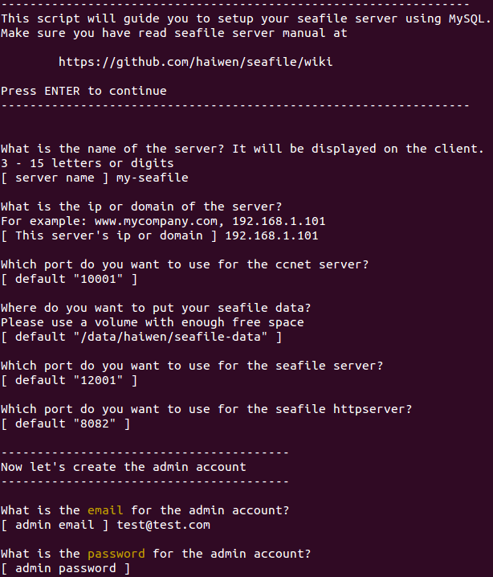
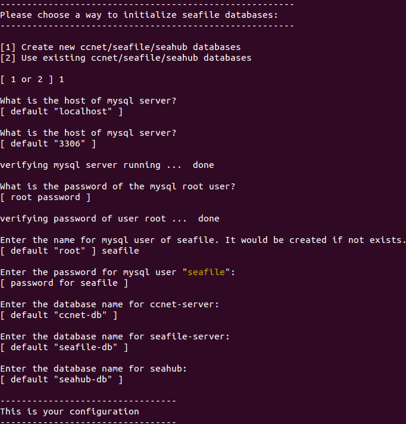
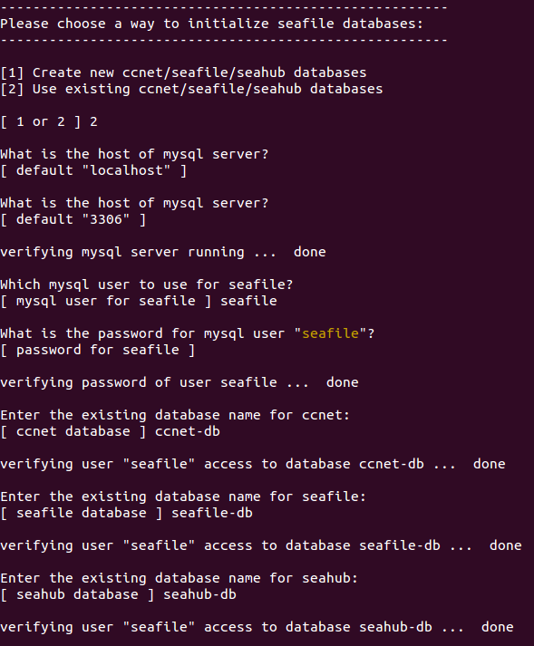

# Deploying Seafile with MySQL

This manual explains how to setup and run seafile server from a pre-built package with MySQL.

## Download

[Download](http://www.seafile.com/en/download) the latest server package.

<pre>
#check if your system is x86 (32bit) or x86_64 (64 bit)
uname -m
</pre>

For Seafile Server 2.1.4 and later:

<pre>
#download for 32bit
https://bitbucket.org/haiwen/seafile/downloads/seafile-server_{version}_i386.tar.gz
#or for 64bit
https://bitbucket.org/haiwen/seafile/downloads/seafile-server_{version}_x86-64.tar.gz
</pre>


## Deploying and Directory Layout

Supposed your organization's name is "haiwen", and you've downloaded seafile-server_1.8.2_* into your home directory.
We suggest you to layout your deployment as follows :

<pre>
mkdir haiwen
mv seafile-server_* haiwen
cd haiwen
# after moving seafile-server_* to this directory
tar -xzf seafile-server_*
mkdir installed
mv seafile-server_* installed
</pre>

Now you should have the following directory layout
<pre>
#tree haiwen -L 2
haiwen
├── installed
│   └── seafile-server_1.8.2_x86-64.tar.gz
└── seafile-server-1.8.2
    ├── reset-admin.sh
    ├── runtime
    ├── seafile
    ├── seafile.sh
    ├── seahub
    ├── seahub.sh
    ├── setup-seafile.sh
    └── upgrade
</pre>

'''The benefit of this layout is that'''

* We can place all the config files for Seafile server inside "haiwen" directory, making it easier to manage.
* When you upgrade to a new version of Seafile, you can simply untar the latest package into "haiwen" directory. ''In this way you can reuse the existing config files in "haiwen" directory and don't need to configure again''.

## Prepare MySQL Databases

Three components of Seafile Server need their own databases:

* ccnet server
* seafile server
* seahub

See [Seafile Server Components Overview](components.md) if you want to know more about the seafile server components.

There are two ways to intialize the databases:

- let the <code>setup-seafile-mysql.sh</code> script create the databases for you.
- create the databases by yourself, or someone else (the database admin, for example)

We recommend the first way. The script would ask you for the root password of the mysql server, and it will create:

* database for ccnet/seafile/seahub.
* a new user to access these databases

However, sometimes you have to use the second way. If you don't have the root password, you need someone who has the privileges, e.g., the database admin, to create the three databases, as well as a mysql user who can access the three databases for you. For example, to create three databases: <code>ccnet-db</code> / <code>seafile-db</code> / <code>seahub-db</code> for ccnet/seafile/seahub respectively, and a mysql user "seafile" to access these databases:

<pre>
create database `ccnet-db` character set = 'utf8';
create database `seafile-db` character set = 'utf8';
create database `seahub-db` character set = 'utf8';

create user 'seafile'@'localhost' identified by 'seafile';

GRANT ALL PRIVILEGES ON `ccnet-db`.* to `seafile`;
GRANT ALL PRIVILEGES ON `seafile-db`.* to `seafile`;
GRANT ALL PRIVILEGES ON `seahub-db`.* to `seafile`;
</pre>

## Setting Up Seafile Server

### Prerequisites

The Seafile server package requires the following packages have been installed in your system

* python 2.6.5+ or 2.7
* python-setuptools
* python-simplejson
* python-imaging
* python-mysqldb

<pre>
#on Debian/Ubuntu
apt-get update
apt-get install python2.7 python-setuptools python-simplejson python-imaging python-mysqldb
</pre>

### Setup

<pre>
cd seafile-server-*
./setup-seafile-mysql.sh  #run the setup script & answer prompted questions
</pre>

If some of the prerequisites are not installed, the seafile initialization script will ask you to install them.

You'll see these outputs when you run the setup script



The script will guide you through the settings of various configuration options.

** Seafile configuration options **

| Option | Description | Note |
| -- | -- | ---- |
| server name | Name of this seafile server | 3-15 characters, only English letters, digits and underscore ('_') are allowed |
| server ip or domain | The IP address or domain name used by this server | Seafile client program will access the server with this address |
| ccnet server port | The TCP port used by ccnet, the underlying networking service of Seafile | Default is 10001. If it's been used by other service, you can set it to another port. |
| seafile data dir | Seafile stores your data in this directory. By default it'll be placed in the current directory.  | The size of this directory will increase as you put more and more data into Seafile. Please select a disk partition with enough free space.  |
| seafile server port | The TCP port used by Seafile to transfer data | Default is 12001. If it's been used by other service, you can set it to another port.  |
| httpsever  port | The TCP port used by Seafile httpserver | Default is 8082. If it's been used by other service, you can set it to another port.  |


At this moment, you will be asked to choose a way to initialize seafile databases:

```sh
-------------------------------------------------------
Please choose a way to initialize seafile databases:
-------------------------------------------------------

[1] Create new ccnet/seafile/seahub databases
[2] Use existing ccnet/seafile/seahub databases

```


Which one to choose depends on if you have the root password.

* If you choose "1", you need to provide the root password. The script would create the databases and a new user to access the databases
* If you choose "2", the ccnet/seafile/seahub databases must have already been created, either by you, or someone else.

If you choose "[1] Create new ccnet/seafile/seahub databases", you would be asked these questions:

You'll see these output:


| Question | Description | Note
| -- | -- | ---- |
| mysql server host | the host address of the mysql server | the default is localhost |
| mysql server port | the port of the mysql server | the default is 3306. Almost every mysql server uses this port.  |
| root password | the password of mysql root account | the root password is required to create new databases and a new user |
| mysql user for seafile | the username for seafile programs to use to access MySQL server | if the user does not exist, it would be created |
| password for seafile mysql user | the password for the user above | |
| ccnet dabase name | the name of the database used by ccnet, default is "ccnet-db" | the database would be created if not existing |
| seafile dabase name | the name of the database used by seafile, default is "seafile-db" | the database would be created if not existing |
| seahub dabase name | the name of the database used by seahub, default is "seahub-db" | the database would be created if not existing |


If you choose "[2] Use existing ccnet/seafile/seahub databases", you would be asked these questions:

You'll see these output:


** related questions for "Use existing ccnet/seafile/seahub databases" **

| Question | Description | Note |
| -- | -- | ---- |
| mysql server host | the host address of the mysql server | the default is localhost |
| mysql server port | the port of the mysql server | the default is 3306. Almost every mysql server uses this port |
| mysql user for seafile | the user for seafile programs to use to access MySQL server | the user must already exists |
| password for seafile mysql user | the password for the user above | |
| ccnet dabase name | the name of the database used by ccnet | this database must already exist |
| seafile dabase name | the name of the database used by seafile, default is "seafile-db" | this database must already exist |
| seahub dabase name | the name of the database used by seahub, default is "seahub-db" | this database must already exist |


If the setup is successful, you'll see the following output


Now you should have the following directory layout :
```sh
#tree haiwen -L 2
haiwen
├── ccnet               # configuration files
│   ├── ccnet.conf
│   ├── mykey.peer
│   ├── PeerMgr
│   └── seafile.ini
├── installed
│   └── seafile-server_1.8.2_x86-64.tar.gz
├── seafile-data
│   └── seafile.conf
├── seafile-server-1.8.2  # active version
│   ├── reset-admin.sh
│   ├── runtime
│   ├── seafile
│   ├── seafile.sh
│   ├── seahub
│   ├── seahub.sh
│   ├── setup-seafile.sh
│   └── upgrade
├── seafile-server-latest  # symbolic link to seafile-server-1.8.2
├── seahub-data
│   └── avatars
├── seahub_settings.py   # optional config file
└── seahub_settings.pyc
```

The folder <code>seafile-server-latest</code> is a symbolic link to the current seafile server folder. When later you upgrade to a new version, the upgrade scripts would update this link to keep it always point to the latest seafile server folder.

## Running Seafile Server

### Before Running

Since Seafile uses persistent connection between client and server, if you have '''a large number of clients ''', you should increase Linux file descriptors by ulimit before start seafile, like:

<pre>
ulimit -n 30000
</pre>

### Starting Seafile Server and Seahub Website

Under seafile-server-1.8.2 directory, run the following commands

* Start seafile:

<pre>
./seafile.sh start # Start seafile service
</pre>

* Start seahub

<pre>
./seahub.sh start <port>  # Start seahub website, port defaults to 8000
</pre>

'''Note:''' The first time you start seahub, the script would prompt you to create an admin account for your seafile server.

After starting the services, you may open a web browser and types
<pre>
http://192.168.1.111:8000/
</pre>
you will be redirected to the Login page. Enter the username and password you were provided during the Seafile setup. You will then be returned to the <code>My Home</code> page where you can create libraries.

'''Congratulations!''' Now you have successfully setup your private Seafile server.

#### Run Seahub on another port

If you want to run seahub in a port other than the default 8000, say 8001, you must:

* stop the seafile server
<pre>
./seahub.sh stop
./seafile.sh stop
</pre>

* modify the value of <code>SERVICE_URL</code> in the file <code>haiwen/ccnet/ccnet.conf</code>, like this: (assume your ip or domain is <code>192.168.1.100</code>)
<pre>
SERVICE_URL = http://192.168.1.100:8001
</pre>

* restart seafile server
<pre>
./seafile.sh start
./seahub.sh start 8001
</pre>

see [Seafile server configuration options](server_configuration.md) for more details about <code>ccnet.conf</code>.

## Stopping and Restarting Seafile and Seahub

#### Stopping

<pre>
./seahub.sh stop # stop seahub website
./seafile.sh stop # stop seafile processes
</pre>

#### Restarting

<pre>
./seafile.sh restart
./seahub.sh restart
</pre>

#### When the Scripts Fail

Most of the time, seafile.sh and seahub.sh work fine. But if they fail, you may

* Use '''pgrep''' command to check if seafile/seahub processes are still running

<pre>
pgrep -f seafile-controller # check seafile processes
pgrep -f "manage.py run_gunicorn" # check seahub process
</pre>

* Use '''pkill''' to kill the processes

<pre>
pkill -f seafile-controller
pkill -f "manage.py run_gunicorn"
</pre>

##That's it!##
That's it! Now you may want read more about seafile.


* [Deploy Seafile with Nginx](deploy_with_nginx.md) / [Deploy Seafile with Apache](deploy_with_apache.md)
* [Enable Https on Seafile Web with Nginx](https_with_nginx.md) / [Enable Https on Seafile Web with Apache](https_with_apache.md)
* [Configure Seafile to use LDAP](using_ldap.md)
* [How to manage the server](../maintain/README.md)
