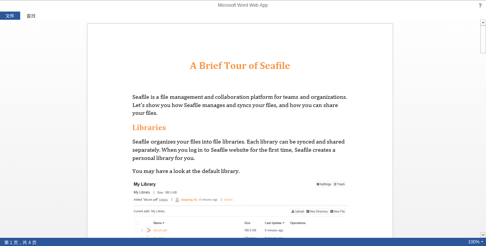

# Office Web app

In pro version 4.4.0(or above), you can use Microsoft Office Web App to preview document online. Office Web App provides the best preview for all Office format files. For organizations with Microsoft Office Volume License, it's free to use Office Web App. For more information about Office Web App and how to deploy it, please refer to https://technet.microsoft.com/en-us/library/jj219456.aspx .

Seafile's own Office file preview is still the default. To use Office Web App for preview, please add following config to seahub_settings.py.

``` python
# Enable Office Web App
ENABLE_OFFICE_WEB_APP = True

# Url of Office Web App's discovery page
# The discovery page tells Seafile how to interact with Office Web App when view file online
# You should change `http://example.office-web-app.com` to your actual Office Web App server address
OFFICE_WEB_APP_BASE_URL = 'http://example.office-web-app.com/hosting/discovery'

# Expiration of WOPI access token
# WOPI access token is a string used by Seafile to determine the file's
# identity and permissions when use Office Web App view it online
# And for security reason, this token should expire after a set time period
WOPI_ACCESS_TOKEN_EXPIRATION = 30 * 60 # seconds

# Tuple of file format that you want to view through Office Web App
# You can change this value according to your preferences
# And of course you should make sure your Office Web App support to preview
# the specified extension file you add below
OFFICE_WEB_APP_FILE_EXTENSION = ('ods', 'xls', 'xlsb', 'xlsm', 'xlsx','ppsx', 'ppt',
    'pptm', 'pptx', 'doc', 'docm', 'docx')

# Enable edit file through Office Web App
ENABLE_OFFICE_WEB_APP_EDIT = True

# types of files editing through Office Web App
# Note, Office Web App 2016 is needed for editing docx
OFFICE_WEB_APP_EDIT_FILE_EXTENSION = ('xlsx', 'pptx', 'docx')

# HTTPS authentication related

# Server certificates
# Path to a CA_BUNDLE file or directory with certificates of trusted CAs
# NOTE: If set this setting to a directory, the directory must have been processed using the c_rehash utility supplied with OpenSSL.
OFFICE_WEB_APP_SERVER_CA = '/path/to/certfile'


# Client certificates
# You can specify a single file (containing the private key and the certificate) to use as client side certificate
OFFICE_WEB_APP_CLIENT_PEM = 'path/to/client.pem'

# or you can specify these two file path to use as client side certificate
OFFICE_WEB_APP_CLIENT_CERT = 'path/to/client.cert'
OFFICE_WEB_APP_CLIENT_KEY = 'path/to/client.key'
```

Then restart

```
./seafile.sh restart
./seahub.sh restart
```

After you click the document you specified in seahub_settings.py, you will see the new preview page.



## Trouble shooting

Understanding how the web app integration work will help you debug the problem. When a user visit a file page:

1. (seahub->browser) Seahub will generate a page containing an iframe and send to the browser
2. (broswer->office web app) With the iframe, the browser will try to load the file preview page from the office web app
3. (office web app->seahub) Office web app receives the request and send a request to Seahub to get the file content
4. (office web app->browser) Office web app send the file preview page to the browser.

Please check the Nginx log for Seahub (for step 3) and Office Web App to see which step is wrong.
